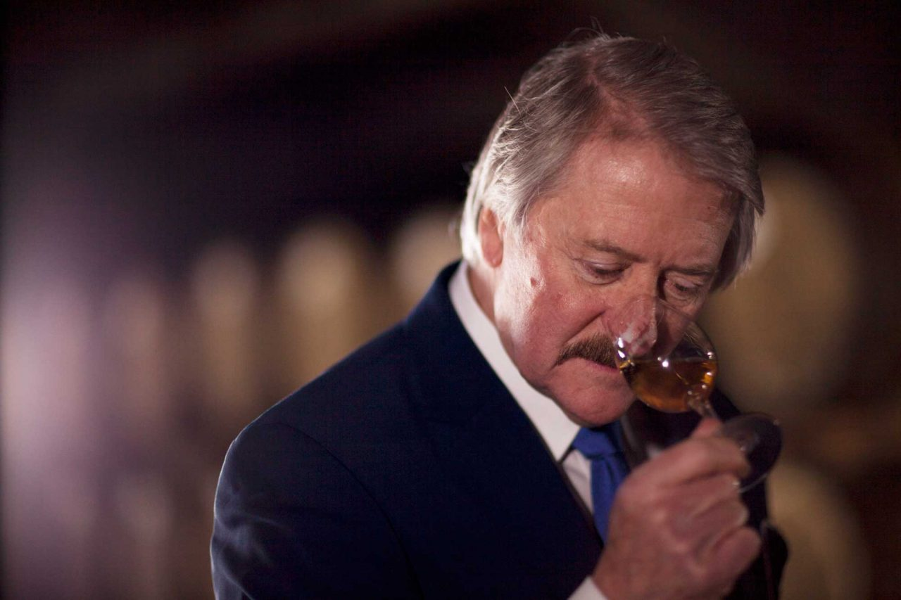

# Of digestive biscuits, old leather, and smoked ham: making sense of the language of Scotch whisky

The language of Scotch tasting notes can be colorful and arcane with the not infrequent traversal into the land of the absolutely ridiculous. One tasting note of a Scotch from an expert taster goes like this:

>Nose: This opens on big, smoky muscular peat notes. There are spices, and liquorice, as well as a big dose of salt. It appears beautifully on the nose, amidst the classic iodine/sticking plasters and cool wood smoke we love.

>Palate: Seaweed-led, with a hint of vanilla ice cream and more than a whiff of notes from the first aid box (TCP, plasters etc). The oak is big, and muscles its way into the fore as you hold this whisky over your tongue. An upsurge of spices develop – cardamom/black pepper/chilli.

>Finish: Big and drying, as the savoury, tarry notes build up with an iodine complexity.

But of course...the classic iodine/sticking plasters we love...aaahhhh there it is...a refreshing and comforting whiff of the first aid box.

<figure align = "center">

<figcaption align = "center"><b>Fig.1 - Rich Paterson, master Scotch blender, vigorously nosing a whisky.</b></figcaption>
</figure>

Besides the oddness of these tasting notes and general hilarity that can ensue from reading them, there is another thing worth noting. *The notes, while couched in metaphor, are often highly specific.* Scotch whisky tasting notes can have references to very specific sensory experiences and descriptors. There are many questions here:

1. Within the array of these specific descriptors, does a central set exist? By this we mean a lexicon that contains words that occur frequently enough across expert tasting notes but not too frequently as to have no descriptive power at all.
2.  Are there groupings among these descriptors? Do these groups corresponds to meaningful taste/smell types within the domain of Scotch whisky?
3. Can we more profitably understand Scotches in terms of these general groupings and use these to compare Scotches to each other?

**This project attempts to answer these questions by first constructing a tasting note dictionary from a repository of expert tasting notes. We then employ various dimensionality reduction techniques and topic modeling to discover any structure within the set of descriptors. This structure is used to get a more robust breakdown of the flavor profiles of various Scotches. We then test these groupings by building a Scotch whisky recommendation engine.**

